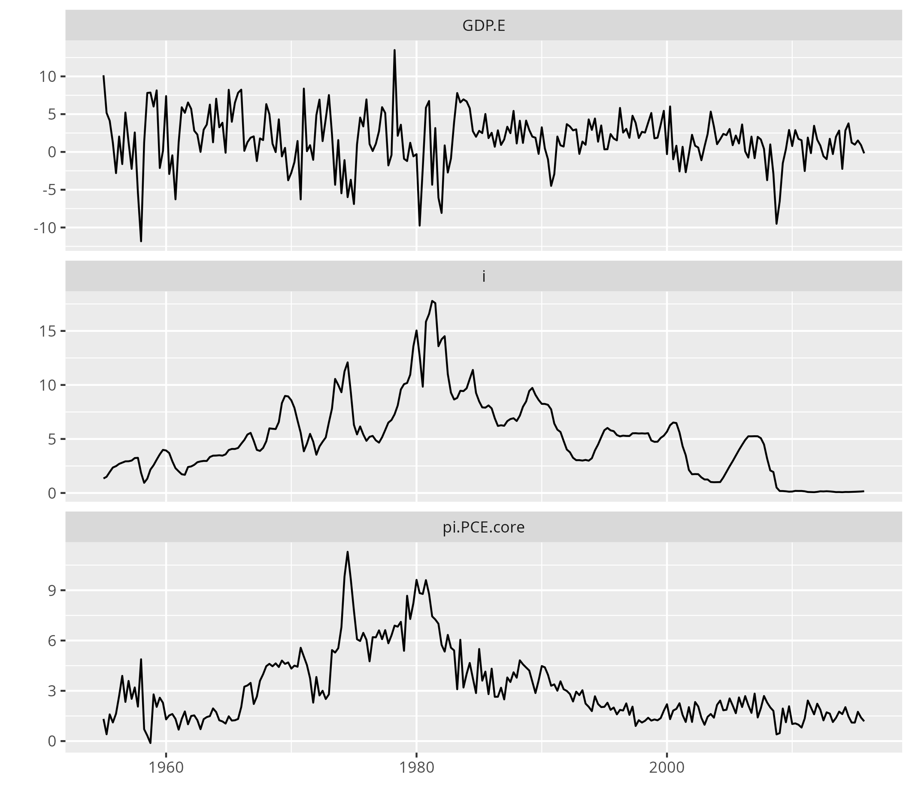
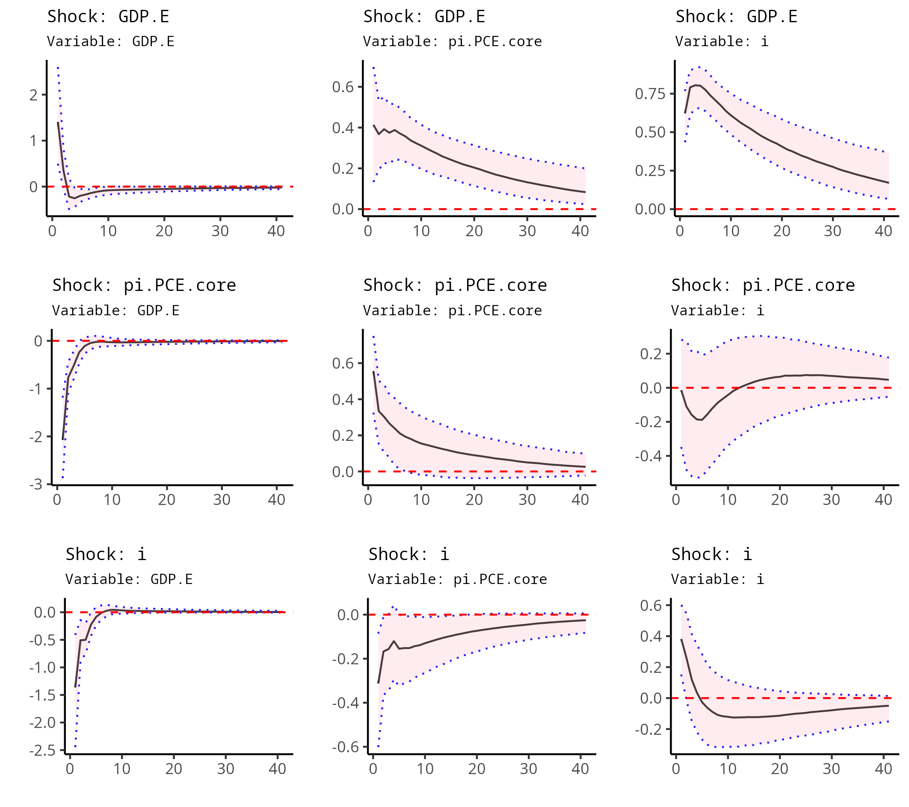
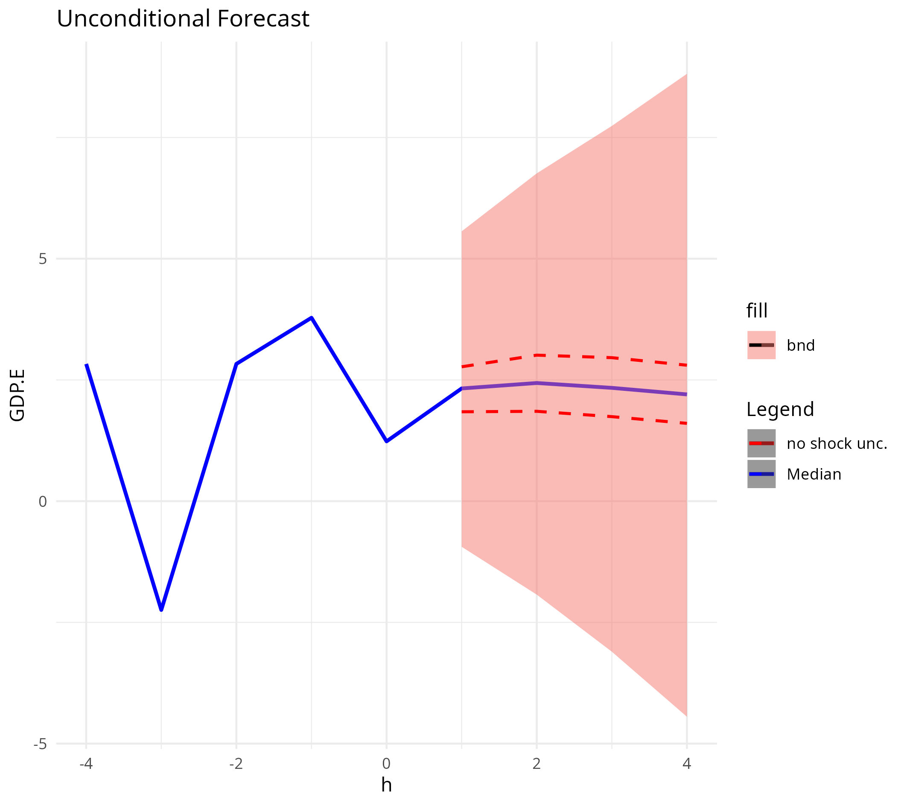
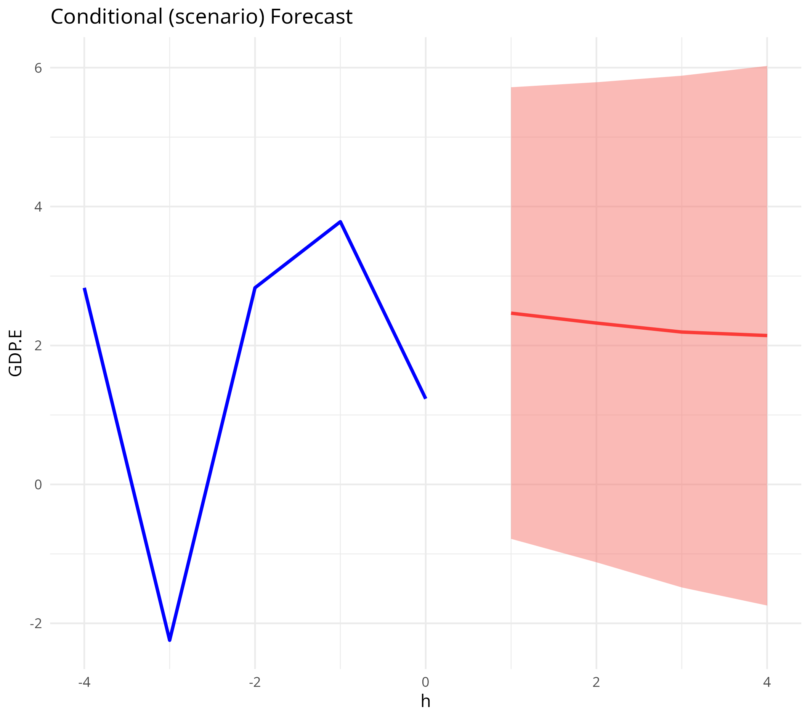
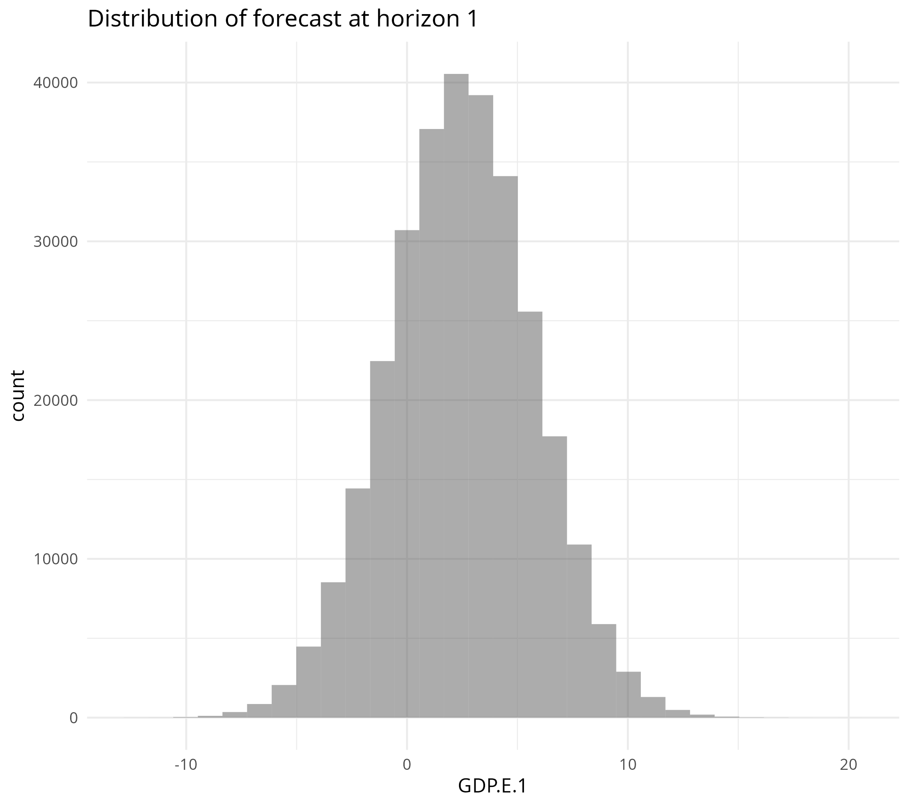
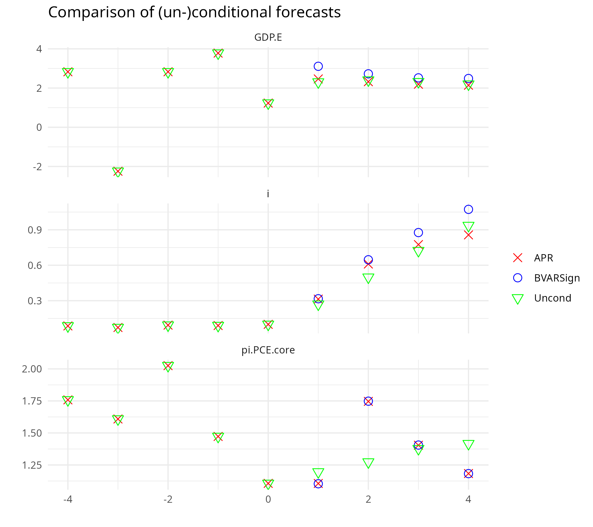

=======
  %\VignetteEngine{knitr::rmarkdown}
  %\VignetteEncoding{UTF-8}
execute:
  cache: true
---

```{r}
library(APRScenario)
```
>>>>>>> main


```{r setup, include=FALSE,echo=FALSE}
knitr::opts_chunk$set(cache = TRUE, echo = FALSE, include = TRUE, warning = FALSE, comment = NA, out.width="70%", out.height="70%",fig.align = "center", dpi=100,units="cm" ,fig.height=20, fig.width=20, out.width="120%")
```

# Scenario analysis

Following Andolin-Diaz, Petrella and Rubio-Ramirez (JME 2021; APR henceforth) this document derives the necessary functions to produce scenario analyses. The BVAR is estimated using the package BVARSign. The output of the estimation is then used to create the objects necessary for scenario analysis.

## Create Forecast Functions

The estimation generates the necessary reduced-form and structural matrices for the model

$y_{t+1}=\sum_i^p y_{t+1-i}^{'} B_i +\varepsilon_{t+1}^{'} M$. Note that APR use different notations than BVARSign. The latter expresses the reduced form BVAR as

$$Y=AX+E$$.

Hence the matrices coming out of the code must be transposed, i.e. $A^{'}=B$.

APR, following Waggoner and Zha (1999) suggest this formula

$$
N_{h}^\ell=\sum_{j=1}^{h-1}N_{h-j}^\ell B_{j}+B_{h+\ell-1}
$$

with

$$
N_1^\ell=B_\ell
$$

So for example for $\ell=1$ and $h=2$

$$
N_2^1=B_1B_1+B_2
$$

and $\ell=2$

$$
N_2^2 = B_2B_1+B_3
$$

where $B_{j>\text{number of lags}}=0$ .

For $h=3$

$$
N_3^1=N_2^1B_1+N_1^1B_2=B_1B_1B_1+B_2B_1+B_1B_2+\left(B_{3}=0\right) 
$$
etc.

Simulation of the future shocks gives all possible future realizations which can be used to generate credible sets for $y_{t+h}$.

Total uncertainty is given by the future shocks and the uncertainty related to the estimated parameters. We can use the posterior distribution of the estimates to characterize this uncertainty.

### Conditional Forecast

Imagine have a vector of future data for all variables $\tilde f_{T+1,T+h}$ , then the only way that this can be supported by the model is that there will be a set of future shocks $\tilde \varepsilon_{T+1,T+h}$ that brings about the data. The same can be said for a subset of variables eg selected via the selection matrix $C$ , eg for h=1 (for h\>1 would have a 1 every $n_v*(j-1)+1$ in the first row and $n_v*(j-1)$ columns in the second row where $j=\{1...h\}$

$$
C=\left.\underbrace{\left[\begin{matrix}
1&0&\ldots&0\\
0&0&\ldots&1
\end{matrix}\right]}_{h\cdot n_v}\right\}k
$$

selecting the first and last variables.

Thus

$$
f_{T+1,T+h}=Cb_{T+1,T+h}+CM^{\prime}\tilde \varepsilon_{T+1,T+h}
$$

This set of shocks can be obtained as (see Waggoner and Zha 1999 who allow for set restrictions)

$$
\tilde \varepsilon_{T+1,T+h}=D^{\ast}\left(f_{T+1,T+h}-Cb_{T+1,T+h}\right)
$$

where $D=CM^{\prime}$ ,

$$
M=\left[\begin{matrix}
M_0&M_1&\ldots&M_{h-1}\\
0&M_0&\ldots& M_{h-2}\\
\vdots &\vdots&\ddots&\vdots\\
0&\ldots&\ldots&M_0
\end{matrix}\right]
$$

and $D^{\ast}$ is a suitable pseudo-inverse. APR suggest to use the Penrose inverse.

The non-conditioning variables are extracted as $C_{\perp} y_{T+1,T+h}$ then $P\left[\begin{matrix}C\\C_{\perp}\end{matrix}\right]=I$ where $P$ sorts the variables in the original order.

Note that according to this notation, the unconditional distribution of the forecasts is

$$
y_{T+1,T+h} \sim \mathcal{N}\left(b_{T+1,T+h},M^{\prime} M \right)
$$

which is independent of the orthogonal matrix $Q$.

Note that $f_{T+1,T+h}$ will have a non-degenerate distribution only if we allow for a range of future values ( $\text{\`a la}$ Waggoner and Zha).

APR suggest a different approach. Define the mean of the future path as $f_{T+1,T+h}$ and its variance as $\Omega_f$ (possibly zero in the "hard conditional forecast" of Waggoner and Zha). Then we can say that

$$
C \tilde y_{T+1,T+h}\sim \mathcal{N}\left(f_{T+1,T+h},\Omega_t\right)
$$

where $\tilde y_{T+1,T+h}$ is the conditional forecast outcome for all variables and $C$ thus selects those variables that are restricted.

Then from the VMA representation it must be that

$$
C \tilde y_{T+1,T+h}=Cb_{T+1,T+h}+D \tilde \varepsilon_{T+1,T+h}\sim \mathcal{N}\left(f_{T+1,T+h},\Omega_f\right)
$$

In turn the future shocks' distribution can be written as

$$
\tilde \varepsilon_{T+1,T+h}\sim \mathcal{N}\left(\mu_\varepsilon,\Sigma_\varepsilon\right)
$$where the two moments need to be determined. Following APR define $\Sigma_\varepsilon=I+\Psi_\varepsilon$ so that $\Psi_\varepsilon$ can be interpreted as the deviation of the covariance matrix from that of the unconditional innovations. Analogously, $\mu_\varepsilon$ is the deviation from the unconditional mean (zero). Finally we get two restrictions that allow us to derive the moments of the conditional innovations

$$
\begin{aligned}
Cb_{T+1,T+h}+D\mu_\varepsilon =f_{T+1,T+h}\,\,\,\text{Mean}\\
D\left(I+\Psi_\varepsilon\right)D^\prime = \Omega_f\,\,\, \text{Variance} 
\end{aligned} 
$$ The number of solutions depends on the relative number of restrictions (k) and points \$(h\\cdot n_v)\$. Here is where the Penrose inverse is used.

$$
\begin{aligned}
\mu_\varepsilon = D^\ast\left(f_{T+1,T+h}-Cb_{T+1,T+h}\right)\\
\Sigma_\varepsilon = D^\ast \Omega_f D^{\ast\prime}+\left(I-D^\ast D D^\prime D^{\ast\prime}\right) 
\end{aligned}
$$

Note that the formula for the mean is the same as the formula for the shocks necessary to bring about the desired path in the "hard" forecast. Here it is expressed as mean of a distribution for the particular case in which we seek a set-conditional-forecast.

Note that the choice of $Q$ affects the distribution of the conditional forecast innovations. The Penrose inverse (or actually the LS inverse) would minimize the $\mu_\varepsilon$ and $\Psi_\varepsilon$ (Frobenious norm of them) and thus this solution **minimizes the distance of the conditional from unconditional innovations**. So while $k<h \cdot n_v$ implies multiple solutions, we pick here a particular one.

From

$$
\tilde y_{T+1,T+h}=b_{T+1,T+h}+M^{\prime}\tilde \varepsilon_{T+1,T+h}
$$

we can define the mean of $E \tilde y_{T+1,T+h}=\mu_y$ , and the variance $E \left(y_{T+1,T+h}-\mu_y\right)\left(y_{T+1,T+h}-\mu_y\right)^\prime = \Sigma_y$ as

$$
\begin{aligned}
\mu_y=b_{T+1,T+h}+M'D^\ast\left(f_{T+1,T+h}-C b_{T+1,T+h}\right)\\
\Sigma_y=M^\prime M+M^\prime D^\ast\left(\Omega_f-DD^\prime\right)D^{\ast\prime}M
\end{aligned}
$$ 
**A particular interesting assumption** is $\Omega_f=DD^\prime$ (see equation for conditional) which implies that $\Sigma_y=M^\prime M$, i.e. the unconditional forecast variance.

APR provide arguments to use the Kullback-Leibler (entropy) measure of distance between conditional and unconditional forecasts to assess the plausibility of the former (the above solutions are solutions to the relative entropy problem when $\Omega_f=DD^\prime$)

All the above can immediately be applied to a **conditional-on-observables** forecasting.

By analogy, one could impose restrictions directly on (some of) the innovations. Defining the selection matrix as $\Xi$ , one could impose that
```{=tex}
\begin{equation}
\Xi \tilde \varepsilon_{T+1,T+h}\sim \mathcal{N}\left(g_{T+1,T+h},\Omega_g\right)\label{eq-condforc}
\end{equation}
```

Then defining $\underline{C}=\Xi M^{\prime\,-1}$ , is must be that

$$
\underline{C}\tilde y_{T+1,T+h}\sim \mathcal{N}\left(\underline{f}_{T+1,T+h},\underline{\Omega_f}\right)
$$

where $\underline{f}{\ldots}=\underline{C}b_{\ldots}+g_{\ldots}$ and $\underline{\Omega}f=\Omega_g$. Hence the same formulas derived above apply to **conditional-on-shocks** forecasts

### Scenario analysis

The scenario analysis constrains only a subset of structural shocks to account for the assumed path of some observables. The other shocks are assumed to follow their unconditional distribution.

As above we define a selection matrix $\bar C$ that restricts some of the observables. The matrix $\Xi$ on the contrary imposes that a subset of shocks follows the unconditional distribution.

Combining the two in essence allows only a subset of shocks to drive the conditional forecast.

Note that imposing that some shocks follow their unconditional distribution means that

$$
\Xi \tilde \varepsilon_{T+1,T+h}\sim \mathcal{N}\left(0,I\right)
$$

where

$$
\tilde \varepsilon_{T+1,T+h}=M^{\prime \,-1} \left(b_{T+1,T+h}-\tilde y_{T+1,T+h}\right)
$$

so

$$
\Xi \tilde \varepsilon_{T+1,T+h}=\Xi M^{\prime \,-1} \left(b_{T+1,T+h}-\tilde y_{T+1,T+h}\right)
$$

Note that $\Xi$ selects the "free" (non-driving) shocks.

Can now define

$$
\underline{C}=\Xi M^{\prime\,-1}
$$

Bringing both restrictions together get

$$
\widehat C \tilde y_{T+1,T+h}\sim \mathcal{N}\left(\widehat f_{T+1,T+h},\widehat \Omega_f\right)
$$

Where

$$
\widehat C=\left[\begin{matrix} \overline C\\\underline{C}\end{matrix}\right]
$$

$$
\widehat f_{T+1,T+h}=\left[\begin{matrix}f_{T+1,T+h}\\\underline{C}b_{T+1,T+h}\end{matrix}\right]
$$

and

$$
\widehat \Omega_f=\left[\begin{matrix}\Omega_f& 0\\0& I\end{matrix}\right]
$$

Then can simply draw from @eq-condforc to generate scenarios. Furthermore can define the whole distribution of the scenario, e.g. the tails of it.

Important to notice that there are restrictions on the existence of a solution. If $k>n_v h$ there are no solutions: too many restrictions relative to data points.

```{r Set-directory,echo=FALSE,include=FALSE}

# setwd('/home/gianni/Dropbox/SNB/HousePrices/scenarios/')
#following is because of the German way of typing dates etc.
Sys.setlocale("LC_TIME", "English.UTF-8") # Windows
# Sys.getlocale()

system('mkdir -p figures')
```


```{r Load-necessary-packages}

# install.packages("../APRScenario_0.0.2.0.tar.gz", repos = NULL, type = "source")
devtools::install_github("giannilmbd/APRScenario", ref = "master")
# install.packages("~/Dropbox/SNB/APRScenario_0.0.0.9000.tar.gz", repos = NULL, type = "source")

library(APRScenario)
library(ggplot2)
library(dplyr)
library(ggfortify)
library(gridExtra)
library(tidyr)
library(bsvars)
```


```{r DATA}
data(NKdata)
X0<-NKdata[,-1] %>% as.data.frame()
varbls<-names(X0)
p<-autoplot(X0 %>% ts(.,frequency=4,start=round(NKdata$year[1])),facets=T)+ylab('')+xlab('')


ggsave('data.png',plot=p,device='png',path='figures',width=18,height=16,units = 'cm')

```

```{r Sign-Restriction}

sr <- matrix(NA, nrow = length(varbls), ncol = length(varbls))

# Fill the matrix with sign restrictions as per the previous setup
sr <- matrix(c(
1,-1,-1,# GDP
1,1,-1, # infl
1,NA,1 # interest rate
), nrow = 3, byrow = TRUE)

```





```{r estimate-BVAR}


# ############# Subset of variables
# 1. Baseline VAR --------
subset_<-c(1:3) # start with subsets of variables
#/////////////////////////////
n_draws=1500 # increase for final estimation
p=4 # lags
# possible subsampling
X=X0[1:(nrow(X0)-4),]
# specify the model
specification  = bsvarSIGNs::specify_bsvarSIGN$new(data=as.matrix(X,3,3),
                                      p        = p,
                                       sign_irf = sr[1:3,1:3])

# estimate the model
posterior      = bsvars::estimate(specification, S = n_draws)

# compute and plot impulse responses
irf            = bsvars::compute_impulse_responses(posterior, horizon = 40)
# {
#   X11()
# plot(irf, probability = 0.68)
# }
{
  p<-plot_bvars(irf, significance_level = 0.32,
                central_tendency = 'median', variable_names = varbls, shock_names = varbls)

  {dev.new()
  grid::grid.newpage()  
  grid_arranged_plots <- arrangeGrob(grobs = p[1:9], nrow =3, ncol =3)
  grid.arrange(grobs = p[1:9], nrow =3, ncol =3)

  }
  }

ggsave('irf_bvars.png',plot=grid_arranged_plots,device='png',path='figures',width=18,height=16,units = 'cm')

  
  # grid.arrange(p)


ggsave('irf_bvars.png',plot=p,device='png',path='figures',width=18,height=16,units = 'cm')


sr1<-sr %>% as.data.frame()
rownames(sr1)<-varbls 
names(sr1)<-varbls
knitr::kable(sr1,row.names = T,caption = 'Sign Restrictions: IRF 1 (shocks in col.)')
# sr1 %>% cat(file='figures/sr_bvars.tex')


f_bvar<-bsvars::forecast(
  posterior,
  horizon = 3,
  exogenous_forecast = NULL,
  conditional_forecast = NULL
)
# VAR structure Y'=X'*B+u' (see specification$data_matrices) 

```

```{r, dpi=100,units='cm', fig.height=10, fig.width=10, out.width="100%"}



```


```{r Matrices,echo=TRUE}
# Actual function ---------------
gen_mats()
```

```{r Run-code-for-unconditional-forecast}
{# run all block 
h=4
y_h_all<-forc_h(h,n_sim=200)
y_h<-y_h_all[[1]]
hist_h<-y_h_all[[3]]
b_h<-y_h_all[[4]]
{# extract quantiles
y_h_m<-apply(y_h,c(1,2),FUN=function(x)quantile(x,0.5))
y_h_l<-apply(y_h,c(1,2),FUN=function(x)quantile(x,0.16))
y_h_u<-apply(y_h,c(1,2),FUN=function(x)quantile(x,0.84))


hist_h_l<-apply(hist_h,c(1,2),FUN=function(x)quantile(x,0.16))
hist_h_u<-apply(hist_h,c(1,2),FUN=function(x)quantile(x,0.84))

}
# convert to data frame for better manipulation
{
y_h_m<-as.data.frame(t(y_h_m))
y_h_u<-as.data.frame(t(y_h_u))
y_h_l<-as.data.frame(t(y_h_l))

hist_h_u<-as.data.frame(t(hist_h_u))
hist_h_l<-as.data.frame(t(hist_h_l))


names(y_h_m)<-varbls
y_h_m$h<-1:nrow(y_h_m)
y_h_tot<-pivot_longer(y_h_m,cols=all_of(varbls),names_to='vars',values_to='Median')
names(y_h_l)<-varbls
y_h_l$h<-1:nrow(y_h_l)
y_h_tot<-left_join(y_h_tot,
                   pivot_longer(y_h_l,cols=all_of(varbls),names_to='vars',values_to='LB'),
                   by=c('h','vars'))

names(y_h_u)<-varbls
y_h_u$h<-1:nrow(y_h_u)
y_h_tot<-left_join(y_h_tot,
                   pivot_longer(y_h_u,cols=all_of(varbls),names_to='vars',values_to='UB'),
by=c('h','vars'))

names(hist_h_l)<-varbls
hist_h_l$h<-1:nrow(hist_h_l)
hist_h_tot<- pivot_longer(hist_h_l,cols=all_of(varbls),names_to='vars',values_to='LB_s')

names(hist_h_u)<-varbls
hist_h_u$h<-1:nrow(hist_h_u)
hist_h_tot<-left_join(hist_h_tot,
                   pivot_longer(hist_h_u,cols=all_of(varbls),names_to='vars',values_to='UB_s'),
by=c('h','vars'))


y_h_tot<-left_join(y_h_tot,hist_h_tot,by=c('h','vars'))

}
# inspect result
dt_t<-as.data.frame(t(Y))
dt_t$h=1:nrow(dt_t)
y_data<-pivot_longer(dt_t,cols =all_of(1:n_var),values_to =names(y_h_tot)[3],names_to = "vars" )
y_data<-y_data[y_data$h>=last(y_data$h)-4,]  
  
y_data$h<-y_data$h-max(y_data$h)
y_data$LB<-NA
y_data$UB<-NA
y_data$LB_s<-NA
y_data$UB_s<-NA

y_h_tot<-rbind(y_data,y_h_tot)
y_h_tot<-y_h_tot[order(y_h_tot$h),]
head(y_h_tot)

uncond.forc<-y_h_tot
# plot 


p <- ggplot(uncond.forc[uncond.forc$vars == varbls[1], ], aes(x = h)) +
  # Median line (solid line)
  geom_line(aes(y = Median, color = "med"), linewidth = 1, show.legend = TRUE) +
  
  # Shaded area for 68% HDI
  geom_ribbon(aes(ymin = LB, ymax = UB, fill = "bnd"), 
              alpha = 0.5, show.legend = TRUE) +
  
  # Dashed lines for 68% high credibility band of history
  geom_line(aes(y = LB_s, color = "hist"), 
            linetype = "dashed", linewidth = 0.8, show.legend = TRUE) +
  geom_line(aes(y = UB_s, color = "hist"), 
            linetype = "dashed", linewidth = 0.8, show.legend = FALSE) +
  
  # Labels and theme
  labs(title = "Unconditional Forecast", x = "h", y = varbls[1]) +
  theme_minimal() +
  
  # Custom legend for colors
  scale_color_manual(
    name = "Legend",
    labels=c('med'="Median",'hist'="no shock unc."),
    values = c("med" = "blue",  'hist'= "red")
  ) +
  
  # # Custom legend for fill
  # scale_fill_manual(
  #   name = "Legend",
  #   labels=c('bnd'="no shock unc."),
  #   values = c('bnd' = "lightblue")
  # )+
  theme(legend.position = 'bottom')+
  theme_minimal()


} # end run all block

ggsave('uncond_forc.png',plot=p,device='png',path='figures',width=18,height=16,units = 'cm')
```

```{r}


```

```{r Run-Scenario}
#NB: Y contans the data n_var x T
h=4 # horizon
n_sim=200 # number of shock draws
obs=c(2) # number of observables
pos_cond_vars=obs 
# given the path of the observables
TT=nrow(X0)
path=X0[(TT-h+1):TT,obs]
bvarSign_path=X0[(TT-h+1):TT,]
bvarSign_path[,-obs]<-NA

# give the shocks that are not driving the scenario: NA if all driving
shocks=NA#c(1,2,3)
tmp<-scenarios(h,path,obs,shocks)
mu_eps<-tmp[[1]]
Sigma_eps<-tmp[[2]]
mu_y<-tmp[[3]]
Sigma_y<-tmp[[4]]
big_b<-tmp[[5]]
big_M<-tmp[[6]]

y_h<-SimScen(mu_eps,Sigma_eps,mu_y,Sigma_y,big_b,big_M,n_sim,h,varbls)

# convert to data frames of central and HPD
y_h_m<-apply(y_h,c(1),FUN=function(x)quantile(x,0.5))
y_h_l<-apply(y_h,c(1),FUN=function(x)quantile(x,0.16))
y_h_u<-apply(y_h,c(1),FUN=function(x)quantile(x,0.84))

cond.for<-data.frame(center=y_h_m,variable=rep(varbls,h),hor=sort(rep(1:h,n_var)))
cond.for$lower<-y_h_l
cond.for$upper<-y_h_u
cond.for<-cond.for[,c("hor","variable","lower","center","upper")]


# inspect result
dt_t<-as.data.frame(t(Y))
dt_t$h=1:nrow(dt_t)
y_data<-pivot_longer(dt_t,cols =all_of(1:n_var),values_to =names(cond.for)[4],names_to = "variable" )
y_data<-y_data[y_data$h>=last(y_data$h)-4,]  
  
y_data$hor<-y_data$h-max(y_data$h)
y_data$lower<-NA
y_data$upper<-NA
y_data<-y_data[,names(cond.for)]
cond.for<-rbind(y_data,cond.for)
cond.for<-cond.for[order(cond.for$hor),]

cond.for$hist<-1
cond.for[cond.for$hor<=0,'hist']<-0


p<-plot_cond_forc(varbls[1])
ggsave('cond_forc.png',plot=p,device='png',path='figures',width=18,height=16,units = 'cm')

p<-plot_cond_histo(variable=varbls[1],horizon=1)
ggsave('cond_histo.png',plot=p,device='png',path='figures',width=18,height=16,units = 'cm')
```
```{r}




```

```{r Compare-conditions-APR-with-BVARSign}
# As discused by Jarocinski 2010 there can be multiple solutions when k<n*h. The APR Moore-Penrose inverse is just one of these

tmp_frc<-bsvars::forecast(
  posterior,
  horizon = 4,
  exogenous_forecast = NULL,
  conditional_forecast = as.matrix(bvarSign_path)
)

{f_data<-tmp_frc$forecasts
rownames(f_data)<-varbls
f_h_m<-apply(f_data,c(1,2),FUN=function(x)quantile(x,0.5)) %>% t() %>% as.data.frame()
f_h_m$hor<-1:h
f_h_l<-apply(f_data,c(1,2),FUN=function(x)quantile(x,0.16)) %>% t() %>% as.data.frame()
f_h_l$hor<-1:h
f_h_u<-apply(f_data,c(1,2),FUN=function(x)quantile(x,0.84)) %>% t() %>% as.data.frame()
f_h_u$hor<-1:h

f_h_m<-pivot_longer(f_h_m,cols=!"hor",names_to='variable',values_to = 'centF')
f_h_l<-pivot_longer(f_h_l,cols=!"hor",names_to='variable',values_to = 'lowF')
f_h_u<-pivot_longer(f_h_u,cols=!"hor",names_to='variable',values_to = 'higF')
}
f_h<-left_join(f_h_l,f_h_m,by=c('hor','variable'))
f_h<-left_join(f_h,f_h_u,by=c('hor','variable'))

#f_h
names(uncond.forc)[1:2]<-c("hor","variable")

test2<-left_join(cond.for,f_h,by=c('hor','variable'))
test2<-left_join(test2,uncond.forc,by=c('hor','variable'))
p<-ggplot(data=test2, aes(x=hor)) +
  ylab('')+xlab('')+labs(title='Comparison of (un-)conditional forecasts')+
  geom_point(aes(y=center, color='APR', shape='APR'),size=3) +
  geom_point(aes(y=centF, color='BVARSign', shape='BVARSign'),size=3) +
  geom_point(aes(y=Median, color='Uncond', shape='Uncond'),size=3) +
  facet_wrap(~variable, scales = 'free_y',nrow = 3) +
  scale_color_manual('', values=c('APR'='red', 'BVARSign'='blue', 'Uncond'='green')) +
  scale_shape_manual('', values=c('APR'=4, 'BVARSign'=1, 'Uncond'=6))+theme_minimal()
ggsave('cond_forc_comp.png',plot=p,device='png',path='figures',width=18,height=16,units = 'cm')
```
```{r}


```


```{r Kullback-Leibler measure}

q<-KL(Sigma_eps,mu_eps,h)

hist(q,main='KL measure (ref value 0.5)')

```

